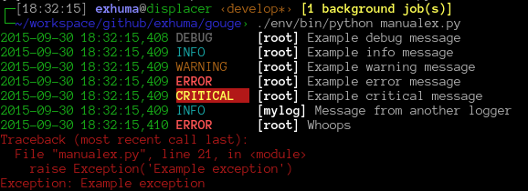

Gouge
=====

.. image:: https://readthedocs.org/projects/gouge/badge/?version=latest
   :target: https://gouge.readthedocs.io/en/latest/?badge=latest
   :alt: Documentation Status

A collection of Python logging formatters. This module contains very predefined
log formatters which helps having a uniform log-output in multiple projects.

The main use-case of this project was (and still is) uniform CLI output with
colorised log messages.

    Example screenshot using the ``colourcli.Simple`` formatter.

Documentation
=============

For more details and the API docs, head over to read-the-docs_

.. _read-the-docs: https://gouge.readthedocs.io/en/latest
